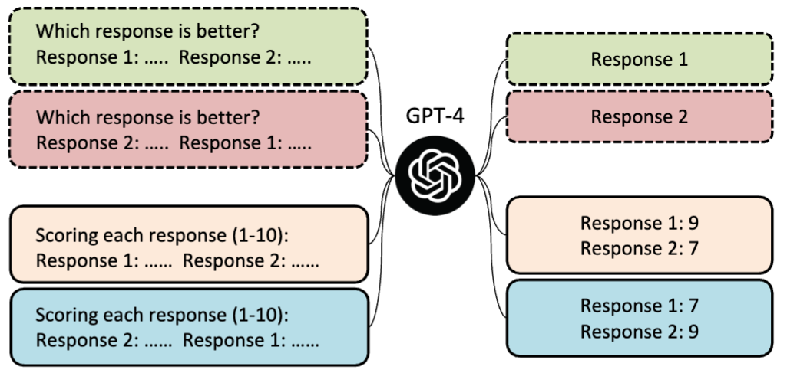
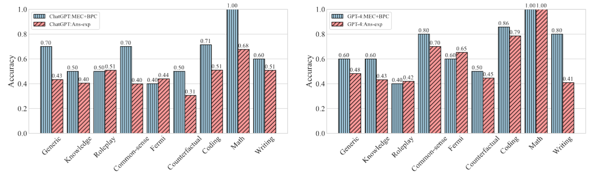

<h1 align="center">Large Language Models are not Fair Evaluators</h1>

# 🔥 Introduction


ChatGPT and GPT-4  have recently demonstrated remarkable performance across various tasks, leading to their widespread use as both the human annotators and evaluators.
However, it is not clear how reliable LLMs are as evaluators, as they are known to be sensitive to textual instructions and inputs.
In this paper, we critically examine the LLMs-as-evaluator paradigm:


- We reveal that LLMs exhibit severe positional bias, compromising their fairness as evaluators.


- We develop two simple yet effective strategies, namely Multiple Evidence Calibration (MEC) and Balanced Position Calibration (BPC) to calibrate the positional bias of LLMs.


- We demonstrate the effectiveness of our proposed approach through experimental results, which show closer alignment with human judgments.




# 🚀 Run FairEval 

Run evaluation with MEC and BPC strategies:

```bash
m1=gpt35
m2=vicuna-13b
eval_model=gpt-3.5-turbo-0301 # evaluaotr gpt-4 or gpt-3.5-turbo-0301
bpc=1  # 0/1 whether use the BPC strategy
k=3 # the evidence number of MEC strategy

# edit your openai key in FairEval.py first
python3 FairEval.py \
    -q question.jsonl \
    -a answer/answer_$m1.jsonl answer/answer_$m2.jsonl \
    -o review/review_${m1}_${m2}_${eval_model}_mec${k}_bpc${bpc}.json \
    -m $eval_model \
    --bpc $bpc \
    -k $k 
    
```


We have also included the human judgment results for the responses generated by Vicuna-13b and ChatGPT in the file `review/review_gpt35_vicuna-13b_human.txt`.
